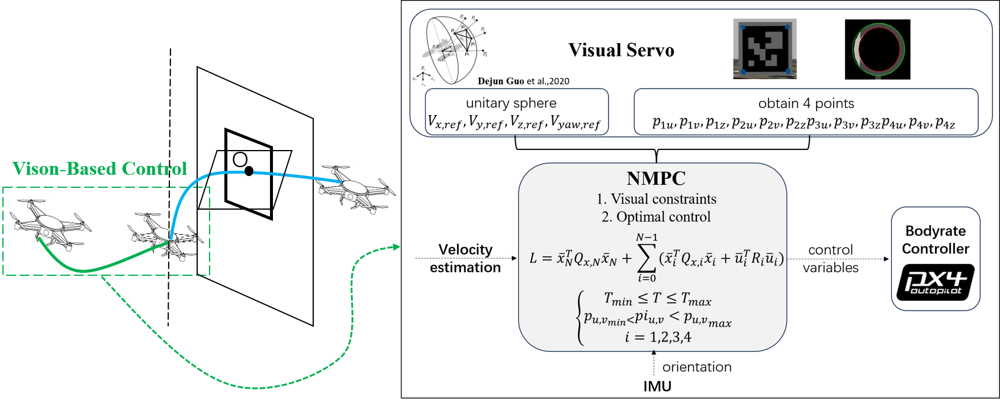

# IBVS_NMPC_PX4_WS
The simulation code of my undergraduate thesis: 

**Perception-constrained Visual Servoing Based NMPC for Quadrotor Flight**

<div style="display: flex; align-items: center;">
    
</div>

## Demo
<div style="display: flex; align-items: center;">
    <video src="./assets/videos/ibvs_nmpc_px4.mp4" alt="teaser" style="margin-right: 10px;">
</div>


## Introduction
In this project, I leveraged Image-Based Visual Servo to control the translation and rotation of the four-rotor UAV, where the expected velocity v was calculated according to the image moment error, and the velocity v was tracked by the Nonlinear Model Predictive Control. Meanwhile, I also take the vision restriction into consideration to prevent the loss of visual features.

## Requirements

- Python 3

- OpenCV 4+

- ROS Noetic

- Gazebo - ROS Noetic
## Package Installation
1. ```bash
	wget -c https://raw.githubusercontent.com/qboticslabs/ros_install_noetic/master/ros_install_noetic.sh && chmod +x ./ros_install_noetic.sh && ./ros_install_noetic.sh
	```
4. ```bash
	sudo apt-get install ros-noetic-desktop-full ros-noetic-joy ros-noetic-octomap-ros ros-noetic-mavlink protobuf-compiler libgoogle-glog-dev ros-noetic-control-toolbox python3-wstool python3-catkin-tools
	```
5. Prepare pip-python3:
   ```bash
	sudo curl https://bootstrap.pypa.io/get-pip.py | sudo python3 
	sudo curl https://bootstrap.pypa.io/get-pip.py | python3
	```
6. ```bash
   echo 'export PATH=$PATH:"$HOME/.local/bin"' >> ~/.bashrc
   source ~/.bashrc
	```
7.  Install the necessary packages of Python3
	```bash
	sudo python3 -m pip install -U rosdep catkin_pkg future 
	python3 -m pip install -U rosdep catkin_pkg future empy defusedxml numpy matplotlib imageio opencv-python
	```

## Usage

1. ```bash 
	git clone https://gitee.com/Hang_SJTU/ibvs_nmpc_px4_ws.git
    ```
2. ```
	catkin build
   ```
	**Declare**：Compile the workspace, Then in the devel/lib directory of this workspace directory, you can find the file `'librealsense_gazebo_plugin.so'` (or possibly `'librealsense_ros_gazebo.so'`, and rename it as `'librealsense_gazebo_plugin.so'`) Copy and paste it under `/opt/ros/noetic/lib/`

3. ```
   source devel/setup.bash
   ```

<!-- 4. ```
   roslaunch rpg_rotors_interface quadrotor_empty_world.launch #target:=circle
   ```
	**Declare**：Launch the Gazebo simulation and drone model file (use_mpc=true)
	Then you need to let the quadrotor fly to the position (-3.5m, 0.0m, 1.0m) using the rqt_gui:
	1. Click `connect`
	2. Click `Arm Bridge`
	3. Click `Start`
	As the initial position is set to be (-3.5m, 0.0m, 1.0m), after clicking the three buttons, the quadrotor is supposed to fly to (-3.5m, 0.0m, 1.0m) approximately. (position z may be 0.87m) -->

4. Spawn the drone and the circle/aruco world:
   ```
   roslaunch simulation_iris_circle.launch # for circle world

   roslaunch simulation_iris_aruco.launch # for aruco world
   ```

5. Detect the target:
   ```
   roslaunch ibvs_pkg ibvs_circle.launch # for circle world

   roslaunch ibvs_pkg ibvs_aruco.launch # for aruco world
   ```

6. Control the drone:
   ```
   roslaunch mpc_pkg mpc_acados_controller.launch # nmpc based on acados 

   roslaunch mpc_pkg mpc_acado_controller.launch  # nmpc based on acado(bad result)
   ```

   **Declare**：Based on the expected speed and IMU feedback attitude estimated by VIO, the C++ code generated by **ACADO** or the Python code of **ACADOS** is used to construct the nmpc model for calculation, and the thrust and 3 direction bodyrates are the output to the underlying controller. 
## Problem
 - [ ] **SO CONFUSED!!!!!**
Current MPC bug, the results calculated by the C code generated based on **ACADO** framework's code generation are inconsistent with the original framework's calculation results (same input), only when the visual features contraints are added into the model.

#### Afterthat, I use **ACADOS** instead of **ACADO** to solve the visual features contraints problem and get ideal results, but the previous problem of **ACADO** still remains.
